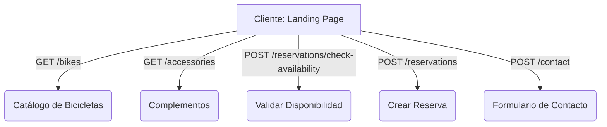

# Guía de Integración de API: BiciVentura (Enfoque del Cliente)

Esta documentación describe las especificaciones para conectar la Landing Page frontend de **BiciVentura** con una API de backend. Como el proyecto es 100% frontend para el cliente, los endpoints definidos a continuación cubren todas las interacciones dinámicas del usuario (catálogo de bicicletas, complementos, cotización/verificación de disponibilidad, creación de reservas y formulario de contacto).

---

## 📌 Configuración General

### Base URL
La URL base sugerida para las llamadas de la API debe configurarse a nivel de entorno (por ejemplo, en un archivo `.env.local`):
```env
NEXT_PUBLIC_API_URL=https://api.biciventura.com/v1
```

### Cabeceras Comunes (Headers)
Todas las peticiones `POST` deben incluir las siguientes cabeceras:
```http
Content-Type: application/json
Accept: application/json
```

---

## 🚴 Endpoints de la API



### 1. Obtener Catálogo de Bicicletas
* **Endpoint**: `/bikes`
* **Método**: `GET`
* **Descripción**: Retorna la lista de bicicletas de la flota con sus especificaciones, tarifas y disponibilidad en tiempo real.

#### 📥 Parámetros de Consulta (Query Params - Opcional)
* `available` (boolean): Filtrar solo bicicletas disponibles para renta. Ej. `/bikes?available=true`

#### 📤 Respuesta Exitosa (200 OK)
```json
[
  {
    "id": "granada-cruiser",
    "name": "Granada Cruiser",
    "type": "cruiser",
    "image": "/images/bikes/granada-cruiser.jpg",
    "description": "Bicicleta estilo cruiser perfecta para pasear por las calles coloniales. Asiento cómodo, canasta incluida y diseño vintage.",
    "features": ["Canasta", "Asiento acolchado", "Cambios 3 velocidades", "Faro LED"],
    "pricePerHour": 5.00,
    "pricePerDay": 25.00,
    "available": true
  },
  {
    "id": "mombacho-mtb",
    "name": "Mombacho MTB",
    "type": "montaña",
    "image": "/images/bikes/mombacho-mtb.jpg",
    "description": "Mountain bike robusta para aventuras en los senderos del volcán Mombacho o rutas fuera del asfalto.",
    "features": ["Suspensión delantera", "Frenos de disco", "21 velocidades", "Llanta antipinchaduras"],
    "pricePerHour": 8.00,
    "pricePerDay": 40.00,
    "available": true
  }
]
```

---

### 2. Obtener Accesorios / Complementos
* **Endpoint**: `/accessories`
* **Método**: `GET`
* **Descripción**: Retorna los complementos adicionales (cascos, candados, etc.) que el cliente puede agregar a su reserva en el asistente de reserva (`ReservationWizard.tsx`).

#### 📤 Respuesta Exitosa (200 OK)
```json
[
  {
    "id": "casco",
    "name": "Casco de seguridad",
    "price": 2.00,
    "icon": "HardHat"
  },
  {
    "id": "candado",
    "name": "Candado U-Lock",
    "price": 1.00,
    "icon": "Lock"
  },
  {
    "id": "silla",
    "name": "Silla para niños",
    "price": 5.00,
    "icon": "Baby"
  }
]
```
> [!NOTE]
> La propiedad `icon` mapea directamente a componentes de iconos Lucide en el frontend (ej. `HardHat`, `Lock`, `Baby`).

---

### 3. Verificar Disponibilidad
* **Endpoint**: `/reservations/check-availability`
* **Método**: `POST`
* **Descripción**: Valida si el conjunto de bicicletas y cantidades seleccionadas por el usuario están disponibles para el rango de fechas y horas elegidas en el Paso 2 del ReservationWizard.

#### 📥 Cuerpo de la Petición (Request Body)
```json
{
  "pickupDate": "2026-05-22",
  "pickupTime": "08:00 AM",
  "returnDate": "2026-05-24",
  "returnTime": "05:00 PM",
  "bikes": [
    {
      "bikeId": "granada-cruiser",
      "qty": 2
    }
  ]
}
```

#### 📤 Respuesta Exitosa - Disponible (200 OK)
```json
{
  "available": true,
  "days": 3,
  "bikesTotal": 150.00,
  "message": "Las bicicletas están listas para las fechas seleccionadas."
}
```

#### 📤 Respuesta de Conflicto - Sin Stock / Agotado (409 Conflict)
```json
{
  "available": false,
  "message": "Conflicto de stock detectado para las fechas seleccionadas.",
  "unavailableBikes": [
    {
      "bikeId": "granada-cruiser",
      "requestedQty": 2,
      "availableQty": 1,
      "reason": "Solo queda 1 unidad disponible del modelo Granada Cruiser para las fechas ingresadas."
    }
  ]
}
```

---

### 4. Crear una Reserva
* **Endpoint**: `/reservations`
* **Método**: `POST`
* **Descripción**: Crea la reserva oficial del cliente. Se invoca cuando el usuario completa el asistente y hace clic en *"Confirmar reserva"*.

#### 📥 Cuerpo de la Petición (Request Body)
```json
{
  "customer": {
    "name": "Juan Pérez",
    "email": "juan.perez@example.com",
    "phone": "+505 8888-8888",
    "nationality": "Nicaragüense",
    "notes": "Prefiero un mapa de la ruta hacia las Isletas si es posible."
  },
  "pickupDate": "2026-05-22",
  "pickupTime": "08:00 AM",
  "returnDate": "2026-05-24",
  "returnTime": "05:00 PM",
  "bikes": [
    {
      "bikeId": "granada-cruiser",
      "qty": 1
    }
  ],
  "accessories": [
    {
      "accessoryId": "casco",
      "qty": 1
    },
    {
      "accessoryId": "candado",
      "qty": 1
    }
  ]
}
```

#### 📤 Respuesta Exitosa - Creado (201 Created)
```json
{
  "success": true,
  "reservationId": "RES-2026-9810A",
  "status": "pending_pickup",
  "summary": {
    "days": 3,
    "bikesTotal": 75.00,
    "accessoriesTotal": 9.00,
    "totalPrice": 84.00,
    "paymentMethod": "Pay on Arrival (Pago en destino)"
  },
  "pickupPoint": {
    "name": "BiciVentura Granada",
    "address": "Frente a la Catedral, Calle La Calzada, Granada, Nicaragua",
    "coordinates": {
      "latitude": 11.9301,
      "longitude": -85.9532
    }
  },
  "qrCodeUrl": "https://api.biciventura.com/v1/reservations/RES-2026-9810A/qrcode.png",
  "createdAt": "2026-05-21T20:12:00Z"
}
```
> [!IMPORTANT]
> El flujo de BiciVentura está diseñado para **pago en persona al momento de la recogida**, por lo que la reserva se inicializa como confirmada y pendiente de pago/recogida (`pending_pickup`).

#### 📤 Respuestas de Error Comunes
* **400 Bad Request** (Faltan campos obligatorios):
```json
{
  "error": "El nombre, correo electrónico y número de teléfono son requeridos."
}
```

---

### 5. Formulario de Contacto / Soporte
* **Endpoint**: `/contact`
* **Método**: `POST`
* **Descripción**: Permite enviar el formulario de consultas de la sección inferior de la landing page.

#### 📥 Cuerpo de la Petición (Request Body)
```json
{
  "name": "María López",
  "email": "maria.lopez@example.com",
  "phone": "+505 7777-7777",
  "message": "Hola, ¿tienen tarifas de descuento para grupos de más de 10 personas?"
}
```

#### 📤 Respuesta Exitosa (200 OK)
```json
{
  "success": true,
  "message": "Tu consulta ha sido enviada con éxito. Nos pondremos en contacto contigo en breve."
}
```

---

## 🛠️ Consejos de Implementación en React / Next.js

1. **Estado de Carga y Errores**:
   En el asistente de reserva (`ReservationWizard.tsx`), se aconseja añadir variables de estado para el manejo de carga (`isLoading`) y errores (`error`) al comunicarse con la API:
   ```tsx
   const [loading, setLoading] = useState(false);
   const [apiError, setApiError] = useState<string | null>(null);
   ```

2. **Utilizar React Query / TanStack Query**:
   Dado que `package.json` ya incluye `@tanstack/react-query`, es altamente recomendado utilizarlo para gestionar el cacheo del catálogo de bicicletas y complementos. Ejemplo:
   ```tsx
   const { data: bikes, isLoading } = useQuery({
     queryKey: ['bikes'],
     queryFn: () => fetch(`${process.env.NEXT_PUBLIC_API_URL}/bikes`).then(res => res.json())
   });
   ```

3. **Integración Directa en ReservationWizard**:
   Actualmente, el componente maneja un estado local simulado al finalizar. Para conectarlo a la API real, modifica la función `handleSubmit` en `ReservationWizard.tsx`:
   ```tsx
   const handleSubmit = async () => {
     setLoading(true);
     setApiError(null);
     try {
       const response = await fetch(`${process.env.NEXT_PUBLIC_API_URL}/reservations`, {
         method: 'POST',
         headers: { 'Content-Type': 'application/json' },
         body: JSON.stringify({
           customer: formData,
           pickupDate: pickupDate?.toISOString().split('T')[0],
           pickupTime,
           returnDate: returnDate?.toISOString().split('T')[0],
           returnTime,
           bikes: cart.map(c => ({ bikeId: c.bikeId, qty: c.qty })),
           accessories: accessories.map(a => ({ accessoryId: a.id, qty: a.qty }))
         })
       });
       
       if (!response.ok) throw new Error('Error al procesar la reserva');
       
       const result = await response.json();
       // Procesar resultado exitoso...
       setCompleted(true);
     } catch (err: any) {
       setApiError(err.message);
     } finally {
       setLoading(false);
     }
   };
   ```
