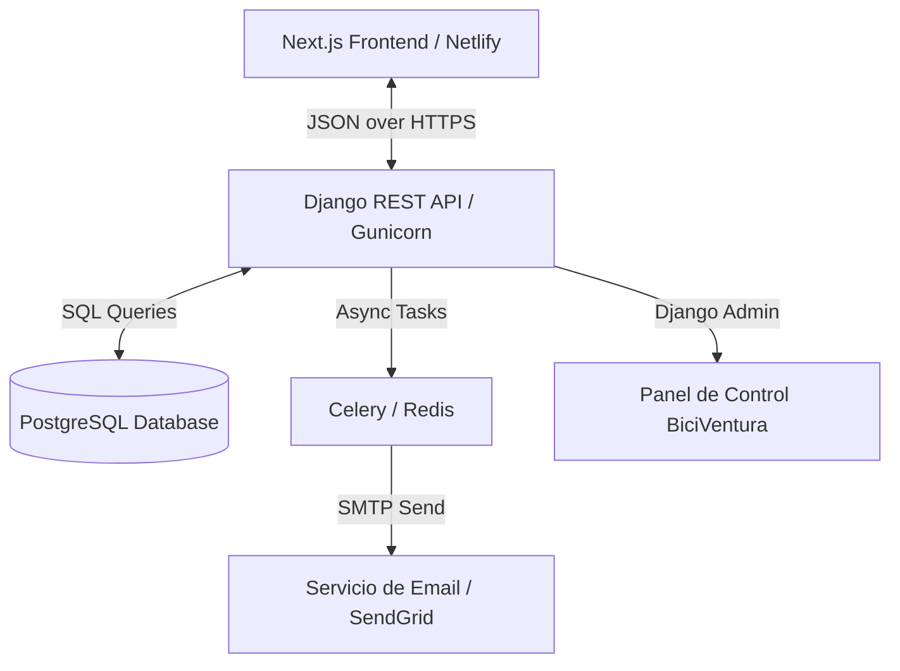

# Especificaciones Técnicas del Backend: BiciVentura
## Arquitectura de API REST con Django, Python y PostgreSQL

Este documento contiene las especificaciones arquitectónicas, de base de datos y de API para construir el backend de la plataforma de alquiler de bicicletas **BiciVentura** utilizando **Python 3.12+**, **Django 5.x** y **Django REST Framework (DRF)**.

---

## 🗺️ Arquitectura General del Sistema

El backend actuará como una **API RESTful sin estado (stateless)**, sirviendo al frontend estático desarrollado en Next.js (desplegado en Netlify). Utilizará **PostgreSQL** como base de datos relacional en producción y un servicio de colas de tareas asíncronas para el envío de correos electrónicos y la generación de códigos QR de recogida.



---

## 🗄️ Modelo de Datos (Base de Datos Relacional)

Para soportar las características del catálogo de bicicletas, la reserva interactiva de 3 pasos, los complementos y el registro bilingüe, se propone el siguiente esquema de base de datos en PostgreSQL.

### 1. `Bike` (Flota de Bicicletas)
Representa las bicicletas disponibles para alquiler.

| Campo | Tipo | Restricciones | Descripción |
| :--- | :--- | :--- | :--- |
| `id` | UUID | Primary Key | Identificador único autogenerado |
| `slug` | SlugField | Unique, db_index | URL amigable de la bicicleta |
| `name` | CharField(100) | | Nombre de la bicicleta (ej. "Granada Cruiser") |
| `type` | CharField(30) | Choices | `URBANA`, `MONTANA`, `CRUISER`, `TANDEM` |
| `price_per_hour` | DecimalField(5,2) | | Precio de alquiler por hora en USD |
| `price_per_day` | DecimalField(5,2) | | Precio de alquiler por día en USD |
| `image` | ImageField | | Foto de la bicicleta |
| `description_es` | TextField | | Descripción en Español |
| `description_en` | TextField | | Descripción en Inglés |
| `is_available` | BooleanField | Default: True | Disponibilidad general de la flota |
| `features_es` | JSONField | Default: [] | Lista de características en ES (ej. canasta, 7 vel) |
| `features_en` | JSONField | Default: [] | Lista de características en EN |
| `created_at` | DateTimeField | auto_now_add | Fecha de registro |

### 2. `Accessory` (Complementos/Accesorios)
Representa los complementos opcionales de alquiler.

| Campo | Tipo | Restricciones | Descripción |
| :--- | :--- | :--- | :--- |
| `id` | UUID | Primary Key | Identificador único |
| `slug` | SlugField | Unique | Identificador URL |
| `name_es` | CharField(100) | | Nombre en Español |
| `name_en` | CharField(100) | | Nombre en Inglés |
| `price_per_day` | DecimalField(5,2) | | Tarifa diaria fija en USD |
| `image` | ImageField | | Icono o foto ilustrativa |
| `is_active` | BooleanField | Default: True | Estado lógico del accesorio |

### 3. `Reservation` (Reserva de Alquiler)
Almacena el estado maestro del alquiler y los datos del cliente.

| Campo | Tipo | Restricciones | Descripción |
| :--- | :--- | :--- | :--- |
| `id` | UUID | Primary Key | Identificador único de reserva (código QR) |
| `customer_name` | CharField(150) | | Nombre completo del viajero |
| `customer_email` | EmailField | | Correo para confirmación y QR |
| `customer_phone` | CharField(30) | | Teléfono o número de WhatsApp |
| `customer_nationality`| CharField(100) | | Nacionalidad seleccionada |
| `pickup_date` | DateField | | Fecha de recogida de la bicicleta |
| `pickup_time` | TimeField | | Hora de recogida |
| `return_date` | DateField | | Fecha de devolución |
| `return_time` | TimeField | | Hora de devolución |
| `duration_days` | PositiveIntegerField| | Duración calculada en días enteros |
| `notes` | TextField | Blank: True | Indicaciones o requerimientos especiales |
| `total_price` | DecimalField(8,2) | | Total calculado (Bicis + Accesorios * días) |
| `status` | CharField(20) | Choices | `PENDING`, `CONFIRMED`, `COMPLETED`, `CANCELLED` |
| `qr_code_image` | ImageField | Blank, Null | Imagen del código QR generado |
| `created_at` | DateTimeField | auto_now_add | Fecha de creación |

### 4. `ReservationItem` (Relación Reserva-Bicicletas)
Detalla qué bicicletas y en qué cantidad se asocian a una reserva.

| Campo | Tipo | Restricciones | Descripción |
| :--- | :--- | :--- | :--- |
| `id` | BigAutoField | Primary Key | ID secuencial |
| `reservation` | ForeignKey | Rel: `Reservation` (cascade) | Reserva asociada |
| `bike` | ForeignKey | Rel: `Bike` (protect) | Bicicleta alquilada |
| `quantity` | PositiveIntegerField| Default: 1 | Cantidad de esta misma bicicleta |
| `unit_price_day`| DecimalField(5,2) | | Copia del precio diario del día de reserva |

### 5. `ReservationAccessory` (Relación Reserva-Accesorios)
Detalla los accesorios elegidos para la reserva.

| Campo | Tipo | Restricciones | Descripción |
| :--- | :--- | :--- | :--- |
| `id` | BigAutoField | Primary Key | ID secuencial |
| `reservation` | ForeignKey | Rel: `Reservation` (cascade) | Reserva asociada |
| `accessory` | ForeignKey | Rel: `Accessory` (protect) | Accesorio alquilado |
| `quantity` | PositiveIntegerField| Default: 1 | Cantidad solicitada |
| `unit_price_day`| DecimalField(5,2) | | Copia de la tarifa unitaria |

### 6. `ContactMessage` (Formulario de Contacto)
Guarda las consultas hechas por los usuarios desde la web.

| Campo | Tipo | Restricciones | Descripción |
| :--- | :--- | :--- | :--- |
| `id` | BigAutoField | Primary Key | ID secuencial |
| `name` | CharField(150) | | Nombre del emisor |
| `email` | EmailField | | Email de contacto |
| `subject` | CharField(200) | | Asunto de la consulta |
| `message` | TextField | | Mensaje redactado |
| `is_read` | BooleanField | Default: False | Control de revisión administrativa |
| `created_at` | DateTimeField | auto_now_add | Fecha de envío |

---

## ⚡ Endpoints del API (Django REST Framework)

Todos los endpoints públicos retornarán respuestas estructuradas en formato JSON y tendrán habilitado el middleware de CORS para comunicarse sin restricciones con el frontend.

### 🌐 Endpoints Públicos

#### 1. Catálogo de Bicicletas
* **`GET /api/v1/bikes/`**: Retorna el listado completo de bicicletas activas.
  * **Filtros**: Permite filtrar por tipo (`?type=cruiser`) y disponibilidad (`?available=true`).
  * **Respuesta (JSON)**:
    ```json
    [
      {
        "id": "8f830a38-c68e-4a6c-9418-877f0a99602e",
        "slug": "granada-cruiser",
        "name": "Granada Cruiser",
        "type": "cruiser",
        "price_per_hour": "3.00",
        "price_per_day": "12.00",
        "image_url": "https://api.biciventura.com/media/bikes/cruiser.jpg",
        "is_available": true,
        "description": {
          "es": "Bicicleta estilo cruiser perfecta para pasear...",
          "en": "Cruiser style bicycle perfect for riding..."
        },
        "features": {
          "es": ["Canasta", "Asiento acolchado", "Cambios 3 velocidades"],
          "en": ["Basket", "Padded seat", "3-speed gears"]
        }
      }
    ]
    ```

#### 2. Catálogo de Accesorios
* **`GET /api/v1/accessories/`**: Lista de complementos con tarifas diarias.
  * **Respuesta (JSON)**:
    ```json
    [
      {
        "id": "2db42867-0c7f-4bdf-868a-cf8e30b65bf7",
        "slug": "helmet",
        "price_per_day": "2.00",
        "image_url": "https://api.biciventura.com/media/accessories/helmet.jpg",
        "name": {
          "es": "Casco de seguridad",
          "en": "Safety helmet"
        }
      }
    ]
    ```

#### 3. Crear Reserva (POST)
* **`POST /api/v1/reservations/`**: Procesa la reserva.
  * **Payload (JSON)**:
    ```json
    {
      "customer_name": "John Doe",
      "customer_email": "john@example.com",
      "customer_phone": "+1 555 123 4567",
      "customer_nationality": "Estados Unidos",
      "pickup_date": "2026-06-01",
      "pickup_time": "09:00:00",
      "return_date": "2026-06-03",
      "return_time": "17:00:00",
      "notes": "Preferiría casco talla L si es posible.",
      "bikes": [
        {
          "bike_id": "8f830a38-c68e-4a6c-9418-877f0a99602e",
          "quantity": 1
        }
      ],
      "accessories": [
        {
          "accessory_id": "2db42867-0c7f-4bdf-868a-cf8e30b65bf7",
          "quantity": 1
        }
      ]
    }
    ```
  * **Lógica del Serializador**:
    1. Validar que las fechas sean congruentes (`pickup_date` <= `return_date`).
    2. Validar que las bicicletas seleccionadas tengan disponibilidad lógica.
    3. Calcular la duración del alquiler (mínimo 1 día).
    4. Calcular el precio unitario y multiplicarlo por los días y cantidad de bicicletas/accesorios para fijar el `total_price`.
    5. Crear el registro `Reservation` en estado `PENDING`.
    6. Guardar los elementos correspondientes en `ReservationItem` y `ReservationAccessory`.
    7. Disparar una **tarea asíncrona** en Celery para:
       * Generar un código QR que contenga la URL segura de verificación: `https://api.biciventura.com/verify-reservation/{uuid}/`.
       * Enviar un correo electrónico en formato HTML estilizado al cliente (con traducción dinámica según su nacionalidad o idioma de procedencia) con el resumen del pedido y el código QR adjunto.
  * **Respuesta (JSON 201 Created)**:
    ```json
    {
      "reservation_id": "d1b54a8e-cfbe-4e3f-8773-45f8e6c78e1a",
      "status": "PENDING",
      "total_price": "28.00",
      "pickup_date": "2026-06-01",
      "pickup_time": "09:00:00",
      "message": {
        "es": "Reserva recibida. Se ha enviado un email de confirmación.",
        "en": "Booking received. A confirmation email has been sent."
      }
    }
    ```

#### 4. Envío de Mensaje de Contacto
* **`POST /api/v1/contact/`**: Almacena el formulario.
  * **Payload (JSON)**:
    ```json
    {
      "name": "Jane Smith",
      "email": "jane@example.com",
      "subject": "Pregunta sobre tours",
      "message": "¿Ofrecen descuentos para grupos de más de 10 personas?"
    }
    ```
  * **Respuesta (JSON 201 Created)**:
    ```json
    {
      "success": true,
      "message": "Message saved successfully."
    }
    ```

---

## 🛠️ Panel Administrativo (Django Admin Custom)

Una de las mayores ventajas de usar Django es el **Admin Panel integrado**. Este se personalizará con librerías modernas como **Django Jazzmin** o **Unfold** para ofrecer una interfaz oscura/limpia con gráficos.

### Funcionalidades Requeridas del Administrador:
1. **Dashboard Principal**:
   * Gráficos interactivos de ingresos mensuales.
   * Total de bicicletas alquiladas hoy y en la semana.
   * Alertas en tiempo real sobre bicicletas pendientes de entrega hoy y devoluciones pendientes hoy.
2. **Filtros Inteligentes**:
   * Filtrar reservas por estado (`Pendientes`, `Confirmadas`, `Finalizadas`, `Canceladas`).
   * Filtrar por rango de fechas de recogida.
3. **Acciones Rápidas (Bulk Actions)**:
   * "Marcar reservas seleccionadas como CONFIRMADAS" (dispara automáticamente correo de confirmación al cliente).
   * "Marcar reservas seleccionadas como COMPLETADAS" (libera las bicicletas de regreso a la flota disponible).
   * "Generar reporte de ingresos en PDF/Excel".
4. **Validación Visual de Recogida (QR Reader Integration)**:
   * Los operadores de BiciVentura frente a la Catedral de Granada pueden escanear el código QR del cliente con un celular.
   * Esto abrirá la vista segura en Django Admin: `/admin/reservations/reservation/{id}/verify/`.
   * En esa pantalla, el operador verá la confirmación inmediata en verde, la lista de bicis/accesorios a entregar, y un botón gigante: **"Entregar Flota (Marcar como Activa)"**.

---

## 📧 Servicio de Tareas Asíncronas (Generación de QR y Correo)

Para evitar tiempos de carga altos en el botón "Confirmar reserva" del cliente en el frontend, el backend utilizará **Celery** con **Redis** como broker.

### Proceso de Generación de QR (Python)
Utilizando la librería `qrcode` de Python:
```python
import qrcode
from io import BytesIO
from django.core.files import File

def generate_reservation_qr(reservation_id):
    qr = qrcode.QRCode(
        version=1,
        error_correction=qrcode.constants.ERROR_CORRECT_L,
        box_size=10,
        border=4,
    )
    # URL de verificación administrativa
    data = f"https://api.biciventura.com/admin/reservations/verify/{reservation_id}/"
    qr.add_data(data)
    qr.make(fit=True)

    img = qr.make_image(fill_color="#070D19", back_color="#FCF9F2") # Colores BiciVentura
    
    blob = BytesIO()
    img.save(blob, 'PNG')
    
    return File(blob, name=f"qr_{reservation_id}.png")
```

### Plantilla de Correo HTML Integrada
El correo será responsivo, aplicando la tipografía **Outfit**, fondo claro, tarjetas de color azul colonial (`#070d19`) y botones amarillos (`#E5A93B`), con el código QR adjunto en el cuerpo del correo.

---

## 🔒 Seguridad y Despliegue

### 1. Configuración de Seguridad
* **Django CORS Headers**: Configurar adecuadamente para que solo el dominio del frontend (`https://biciventura.netlify.app` o tu dominio personalizado) y localhost (para desarrollo) tengan permiso de comunicación.
  ```python
  CORS_ALLOWED_ORIGINS = [
      "https://biciventura.netlify.app",
      "https://www.biciventuras.com", # Tu dominio final
      "http://localhost:3000",
  ]
  ```
* **Variables de Entorno**: Almacenamiento seguro de llaves en producción (`.env` administrado por `django-environ`):
  * `SECRET_KEY`
  * `DEBUG=False`
  * `DATABASE_URL` (Conexión segura de PostgreSQL)
  * `EMAIL_HOST_USER` / `EMAIL_HOST_PASSWORD` (SMTP)

### 2. Infraestructura de Producción Recomendada
* **Hosting**: **Render.com** (Web Service + Managed PostgreSQL) o **DigitalOcean App Platform** (muy económicos y sencillos de configurar con Docker).
* **Servidor Web**: **Gunicorn** detrás de un proxy reverso **Nginx** o directamente servido mediante el balanceador de la plataforma de la nube.
* **Almacenamiento de Ficheros (Imágenes de bicis y QR)**: **Amazon S3** o **DigitalOcean Spaces** configurado mediante `django-storages` para asegurar que las imágenes se carguen de manera ultra rápida mediante una CDN.
