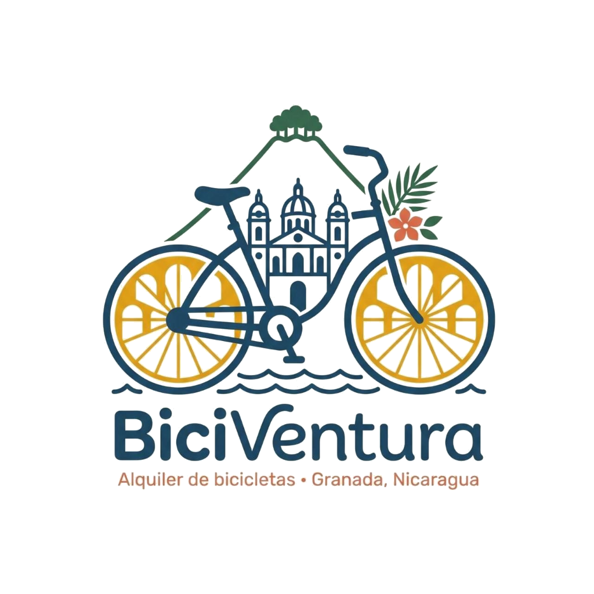

# 🚲 BICIVENTURA

## Ecosistema de Movilidad Sostenible y Reservas de Bicicletas

```text
██████╗ ██╗ ██████╗██╗██╗   ██╗███████╗███╗   ██╗████████╗██╗   ██╗██████╗  ███████╗
██╔══██╗██║██╔════╝██║██║   ██║██╔════╝████╗  ██║╚══██╔══╝██║   ██║██╔══██╗ ██╔════╝
██████╔╝██║██║     ██║██║   ██║█████╗  ██╔██╗ ██║   ██║   ██║   ██║██████╔╝ █████╗  
██╔══██╗██║██║     ██║╚██╗ ██╔╝██╔══╝  ██║╚██╗██║   ██║   ██║   ██║██╔══██╗ ██╔══╝  
██████╔╝██║╚██████╗██║ ╚████╔╝ ███████╗██║ ╚████║   ██║   ╚██████╔╝██║  ██║ ███████╗
╚══════╝ ╚═╝ ╚═════╝╚═╝  ╚═══╝  ╚══════╝╚═╝  ╚═══╝   ╚═╝    ╚══════╝ ╚═╝  ╚═╝ ╚══════╝
```

<div align="center">
  
  
  <p><strong><em>Tu portal de aventura sobre dos ruedas</em></strong></p>

  <!-- Badges -->
  <p>
    
    
    
    
    
    
    
    
  </p>

  <p>
    <em>Una plataforma digital premium que conecta Alquiler de Bicicletas, Rutas Recomendadas, Promociones y Analíticas en tiempo real en Granada, Nicaragua con soporte bilingüe resiliente.</em>
  </p>
</div>

---

## 📋 Tabla de Contenidos

*   [🌟 Propuesta de Valor](#-propuesta-de-valor)
*   [🚀 Características Clave](#-características-clave)
*   [📂 Estructura del Proyecto](#-estructura-del-proyecto)
*   [🛠️ Pila Tecnológica (Tech Stack)](#-pila-tecnológica-tech-stack)
*   [💻 Configuración e Instalación](#-configuración-e-instalación)
*   [📡 Integración del Backend](#-integración-del-backend)

---

## 🌟 Propuesta de Valor
**BiciVentura** es una plataforma web moderna, rápida y responsiva diseñada para el alquiler de bicicletas premium en la histórica ciudad de Granada, Nicaragua. Ofrece una experiencia de usuario única orientada al turismo colonial, combinando una interfaz visual sofisticada (*glassmorphism* con colores de identidad local) con interactividad en tiempo real y soporte bilingüe completo.

---

## 🚀 Características Clave

*   **🪄 Asistente de Reservas Inteligente (`ReservationWizard`)**: Interfaz modular por pasos que permite elegir bicicleta, ingresar datos de contacto, seleccionar fecha y hora de entrega/recogida, y simular pagos con pasarela segura.
*   **🎠 Carrusel de Promociones (`PromoCarousel`)**: Slider táctil y responsivo desarrollado con Framer Motion, con autoplay inteligente que se pausa al pasar el cursor y soporte de arrastre para dispositivos móviles.
*   **📊 Panel de Rendimiento Analítico (`DashboardSection`)**: Dashboard interactivo que muestra métricas simuladas de Google Analytics 4 (GA4), incluyendo gráficos de áreas y barras (Recharts) de visitas, ingresos, canales de adquisición y modelos populares de bicicletas.
*   **🗣️ Experiencia Bilingüe Completa**: Sistema de localización en tiempo real (Español / Inglés) que sincroniza de forma global el idioma del sitio, los menús de navegación y el proceso de reservas mediante un estado centralizado (Zustand).
*   **✨ Estética Colonial Premium**: Diseño visual de alta fidelidad que utiliza los colores de Granada: **Azul Añil** (`#0F2C59`), **Amarillo Colonial** (`#F2A900`), **Coral** (`#E76F51`), **Verde Selva** y **Blanco Cálido** (`#FAF8F5`).

---

## 📂 Estructura del Proyecto

El código fuente está estructurado de manera modular para garantizar escalabilidad y fácil mantenimiento:

```text
biciVentura/
├── documentacion/              # Documentación técnica del proyecto
│   ├── BACKEND_SPECIFICATION.md # Modelos de datos, APIs y lógica de negocio
│   ├── API_INTEGRATION.md      # Flujo de conexión Frontend/Backend
│   └── worklog.md              # Bitácora histórica del desarrollo
├── public/                     # Recursos estáticos (Logos, imágenes)
│   └── images/
│       ├── bikes/              # Fotografías de la flota de bicicletas
│       ├── carrusel/           # Imágenes utilizadas en las promociones
│       └── gallery/            # Galería de paseos de clientes
├── src/
│   ├── app/                    # Next.js App Router (Rutas y páginas)
│   ├── components/
│   │   ├── biciventura/        # Secciones principales de la landing page
│   │   │   ├── Navbar.tsx      # Barra de navegación con Scroll Spy y dock móvil
│   │   │   ├── HeroSection.tsx # Sección principal con llamados a la acción
│   │   │   ├── DashboardSection.tsx # Panel de analíticas web interactivo
│   │   │   └── ...
│   │   └── ui/                 # Componentes genéricos de UI reutilizables
│   │       ├── PromoCarousel.tsx
│   │       └── ...
│   └── hooks/                  # Custom hooks para lógica compartida
├── package.json                # Configuración de dependencias y scripts
└── tsconfig.json               # Configuración estricta de TypeScript
```

---

## 🛠️ Pila Tecnológica (Tech Stack)

### Frontend Core
*   **Framework**: Next.js 16.2.6 (App Router)
*   **Biblioteca**: React 19
*   **Lenguaje**: TypeScript (Tipado estricto)
*   **Estilos**: Tailwind CSS v4 + PostCSS

### Animaciones e Interactividad
*   **Animaciones**: Framer Motion 12
*   **Efecto de Scroll Inercial**: Lenis Scroll (Smooth Scroll global con soporte para anclas y sticky offsets)
*   **Iconografía**: Lucide React
*   **Gráficos de Datos**: Recharts 2.15

---

## 💻 Configuración e Instalación

### Requisitos Previos
*   [Node.js](https://nodejs.org/) v18+ o [Bun](https://bun.sh/)
*   Gestor de paquetes `npm` o `bun`

### 1. Clonar el repositorio e instalar dependencias
```bash
# Instalar con npm
npm install

# Instalar con bun
bun install
```

### 2. Iniciar el entorno de desarrollo
```bash
# Con npm
npm run dev

# Con bun
bun run dev
```
El proyecto estará disponible localmente en: [http://localhost:3000](http://localhost:3000).

### 3. Compilar para producción (Build)
```bash
# Generar compilación optimizada
npm run build

# Iniciar servidor de producción
npm run start
```

---

## 📡 Integración del Backend

El proyecto está preparado para consumir endpoints REST basados en **Django REST Framework (DRF)**. Los endpoints principales y la lógica de la base de datos se encuentran detallados en:
*   [Especificaciones del API y Backend](./documentacion/BACKEND_SPECIFICATION.md)
*   [Guía Paso a Paso de Integración](./documentacion/API_INTEGRATION.md)

---
<div align="center">
  <p>Proyecto Integrador 2026 — Desarrollado para <strong>BiciVentura Granada</strong>.</p>
</div>
